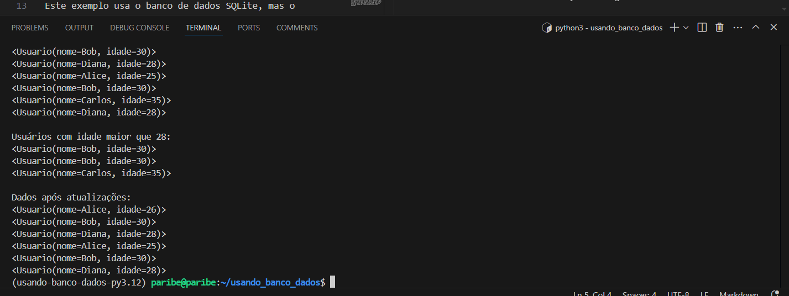

# Exemplo de Uso do SQLAlchemy

Este projeto demonstra como usar o SQLAlchemy, uma biblioteca ORM (Object-Relational Mapping) para interagir com bancos de dados relacionais, como o SQLite. No exemplo abaixo, mostramos como criar uma tabela, inserir, consultar, atualizar e excluir registros de um banco de dados SQLite utilizando SQLAlchemy.

Pré-requisitos
Antes de rodar este exemplo, você precisará ter o Python e o SQLAlchemy instalados. Para instalar o SQLAlchemy, você pode usar o pip:

bash
```
pip install sqlalchemy
```

Este exemplo usa o banco de dados SQLite, mas o SQLAlchemy suporta vários bancos de dados, como MySQL, PostgreSQL, etc.

Código Explicado
python
```
from sqlalchemy import create_engine, Column, Integer, String
from sqlalchemy.ext.declarative import declarative_base
from sqlalchemy.orm import sessionmaker
Aqui, importamos os componentes principais do SQLAlchemy:

create_engine: Cria a conexão com o banco de dados.
Column, Integer, String: Definem as colunas da tabela e seus tipos.
declarative_base: Define a base para nossos modelos ORM.
sessionmaker: Facilita a criação de sessões para interagir com o banco de dados.

```
1. Configuração do Banco de Dados
python
```
engine = create_engine('sqlite:///exemplo.db')  # Cria o banco de dados SQLite
Base = declarative_base()  # Cria a base para nossos modelos ORM
create_engine('sqlite:///exemplo.db'): Cria uma conexão com o banco de dados SQLite. O banco de dados será criado automaticamente se não existir.
Base = declarative_base(): Define a base para os nossos modelos de dados.
```
2. Definindo o Modelo de Tabela (ORM)
python
```
class Usuario(Base):
    __tablename__ = 'usuarios'  # Nome da tabela

    id = Column(Integer, primary_key=True, autoincrement=True)  # Coluna ID
    nome = Column(String, nullable=False)  # Coluna Nome
    idade = Column(Integer, nullable=False)  # Coluna Idade

    def __repr__(self):
        return f"<Usuario(nome={self.nome}, idade={self.idade})>"
```        
Aqui, definimos a classe Usuario que representa uma tabela no banco de dados:

__tablename__ = 'usuarios': Nome da tabela no banco de dados.
id, nome e idade: Definem as colunas da tabela, sendo id a chave primária.
O método __repr__ define a representação de como os objetos da classe serão exibidos.
3. Interagindo com o Banco de Dados
A função main() mostra como interagir com o banco de dados, incluindo operações como inserir, consultar, atualizar e deletar registros.

python
```
def main():
    # Criando a tabela no banco de dados
    Base.metadata.create_all(engine)

    # Criando uma sessão para interagir com o banco de dados
    Session = sessionmaker(bind=engine)
    session = Session()
```
Base.metadata.create_all(engine): Cria as tabelas no banco de dados, se ainda não existirem.
sessionmaker(bind=engine): Cria uma classe de sessão para interagir com o banco de dados.
session = Session(): Cria uma instância de sessão.
4. Inserindo Dados
python
```
    novo_usuario = Usuario(nome="Alice", idade=25)
    session.add(novo_usuario)  # Adiciona um usuário
    session.commit()  # Confirma a transação
```

Aqui, inserimos um novo usuário no banco de dados, definindo os valores para nome e idade.

5. Consultando Dados
python
```
    print("Todos os usuários:")
    for usuario in session.query(Usuario).all():
        print(usuario)
```

Aqui, usamos o método query para obter todos os usuários da tabela usuarios e imprimimos o resultado.

6. Filtrando Dados
python
```
    print("\nUsuários com idade maior que 28:")
    for usuario in session.query(Usuario).filter(Usuario.idade > 28):
        print(usuario)
```

Aqui, mostramos como filtrar os usuários com base em uma condição, no caso, a idade maior que 28.

7. Atualizando Dados
python
```
    usuario_para_atualizar = session.query(Usuario).filter_by(nome="Alice").first()
    if usuario_para_atualizar:
        usuario_para_atualizar.idade = 26
        session.commit()
```
Aqui, atualizamos a idade de um usuário específico, identificado pelo nome "Alice".

8. Deletando Dados
python
```
    usuario_para_deletar = session.query(Usuario).filter_by(nome="Carlos").first()
    if usuario_para_deletar:
        session.delete(usuario_para_deletar)
        session.commit()
```
Este trecho remove um usuário do banco de dados, neste caso, o usuário "Carlos".

9. Fechando a Sessão
python
```
    session.close()
```
Finalmente, fechamos a sessão do banco de dados para liberar os recursos.

Executando o Código
Para rodar o código, basta executar o arquivo app.py:

bash
```
python app.py
Isso criará a tabela usuarios no banco de dados SQLite exemplo.db e executará as operações de inserção, consulta, atualização e exclusão.
```
Conclusão
Este exemplo básico mostra como usar o SQLAlchemy para interagir com um banco de dados SQLite de forma simples e eficiente. Você pode adaptar esse código para outros bancos de dados, como MySQL ou PostgreSQL, mudando a string de conexão do create_engine para o formato adequado.

# Resultado



